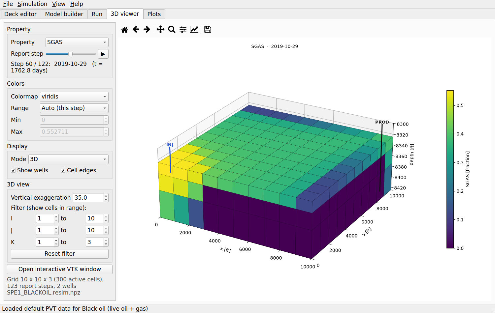
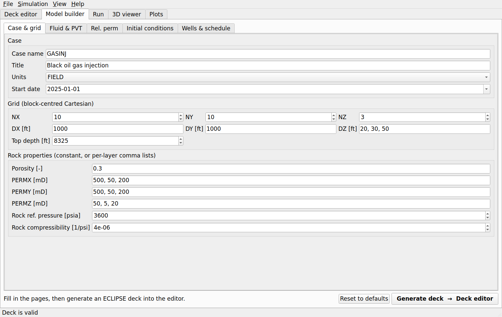
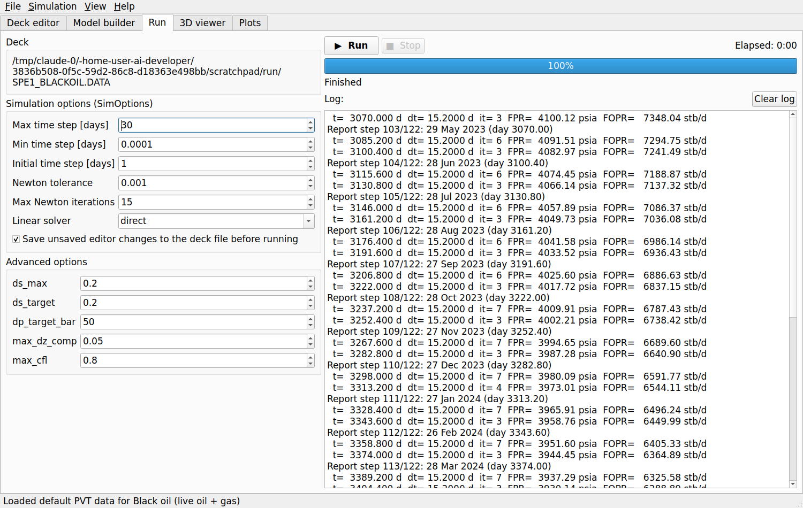
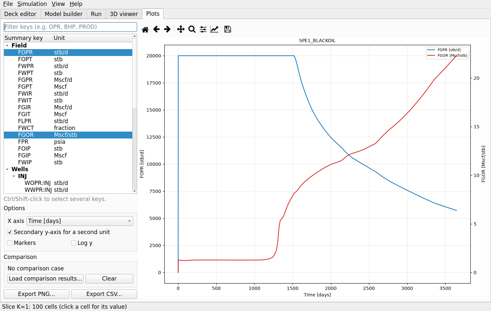
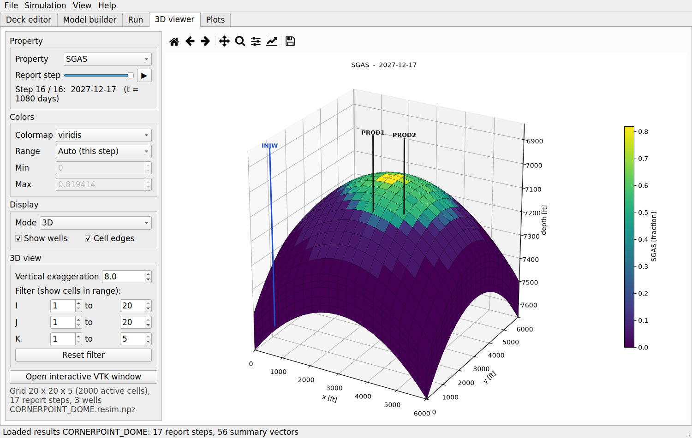
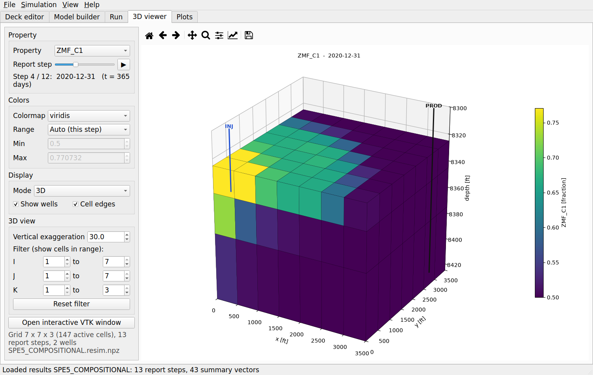

# ReSim — ECLIPSE-deck reservoir simulator with GUI

ReSim reads standard **ECLIPSE `.DATA` decks** and runs 3D **black-oil** (ECLIPSE 100 style) and
**compositional** (ECLIPSE 300 style, cubic equation of state) simulations. It comes with a desktop
GUI for building and editing input decks, running simulations and visualising results in 3D and
as time-series plots. Results are also written in ECLIPSE binary format (EGRID/INIT/UNRST/SMSPEC/UNSMRY),
so they open in ResInsight and other ECLIPSE post-processors.



## Features

| Area | What is supported |
|---|---|
| Deck reader | Full ECLIPSE syntax: `--` comments, repeat counts (`3*0.25`, `2*`), quoted/unquoted strings, `INCLUDE` (relative paths, `PATHS` aliases), sections, multi-record keywords, numbered tables, `PVTO`/`PVTG` record tables. Unknown keywords are skipped with a warning. |
| Grids | Block-centred (`DX/DY/DZ/TOPS`, `DXV/DYV/DZV`) and corner-point (`SPECGRID`, `COORD/ZCORN`, `COORDSYS`), `ACTNUM`, `MINPV`, `NTG`, `MULTX/Y/Z`, `MULTX-/Y-/Z-`, `MULTPV`, `PORV`, `TRANX/Y/Z` overrides, `MULTREGT` between `MULTNUM`/`FLUXNUM`/`OPERNUM` regions; `BOX`, `EQUALS`, `MULTIPLY`, `ADD`, `COPY`, `MINVALUE`, `MAXVALUE` operators. **Faults**: exact face overlaps across displaced (faulted) corner-point columns with non-neighbour connections, `FAULTS` + `MULTFLT`; `PINCH` connections across pinched-out cells (threshold, `GAP`/`NOGAP`, maximum gap, `TOPBOT`/`ALL`); exact trilinear cell volumes. Transmissibilities and pore volumes match ECLIPSE's for the Brugge grid and OPM Flow's for Norne |
| Black-oil (E100) | Fully implicit 3-phase water/oil/gas with dissolved gas (`DISGAS`) and **vaporised oil** (`VAPOIL`, wet gas `PVTG`), dead oil (`PVDO`, `PVCDO`), live oil (`PVTO` with undersaturated branches), dry gas (`PVDG`), `PVTW`, `ROCK` (`ROCKOPTS`: `PVTNUM`/`SATNUM`/`ROCKNUM` tables, `STORE`), `DENSITY`/`GRAVITY`; 2-phase oil-water and oil-gas also work |
| Thermal | `THERMAL`: fully implicit energy equation (temperature as a 4th unknown) with convection, conduction (`THCONR`), rock heat capacity (`HEATCR`), fluid specific heats (`SPECHEAT`), viscosity vs temperature (`OILVISCT`/`WATVISCT`/`GASVISCT`), water expansion (`WATDENT`), ideal-gas expansion of gas, initial temperature (`RTEMP`, `TEMPI`, `RTEMPVD`) and injection temperature (`WTEMP`) |
| CO2 storage (CCUS) | `CO2STORE` with `GAS` + `WATER`: built-in CO2-brine properties (Spycher-Pruess solubility with salinity `SALINITY`, water vaporisation `VAPWAT`, volume-shifted Peng-Robinson CO2 density, Batzle-Wang brine), gas-brine saturation functions (`SGWFN`, `WSF`/`GSF`), CO2 inventory split into dissolved, mobile and residually trapped CO2 (`FGIPL`, `FGIPG`, `FGIPM`, `FGIPR`, `FCO2M`) |
| Compositional (E300) | `COMPS`, `EOS` (PR/SRK), `CNAMES`, `TCRIT`, `PCRIT`, `VCRIT`/`ZCRIT`, `ACF`, `MW`, `BIC`, `OMEGAA/B`, `SSHIFT`, `ZI`/`ZMFVD`, `RTEMP`, `STCOND`, `WELLSTRE` + `WINJGAS` injection streams; Michelsen stability test + successive-substitution flash; Lohrenz-Bray-Clark viscosity; immiscible water phase |
| Saturation functions | `SWOF`/`SGOF` or `SWFN`/`SGFN`/`SOF3`/`SOF2`, capillary pressure, ECLIPSE default 3-phase oil rel-perm model, `SATNUM`/`PVTNUM` regions. **End-point scaling** (`ENDSCALE`; `SWL SWCR SWU SGL SGCR SGU SOWCR SOGCR PCW PCG`, two- or three-point with `SCALECRS`) and **hysteresis** (`SATOPTS HYSTER`, `EHYSTR`: Carlson or Killough scanning curves for the non-wetting phases, `IMBNUM` with imbibition end points `ISWL ISGCR ...`) |
| Initialisation | Hydrostatic `EQUIL` (gas cap, oil zone, aquifer, capillary transition zones, datum in any phase, items 7-8), `RSVD`/`PBVD`, `EQLNUM` regions, **`SWATINIT`** (capillary-pressure scaling), threshold pressures between regions (`EQLOPTS THPRES`, `THPRES`), or enumerated `PRESSURE`/`SWAT`/`SGAS`/`RS`/`PBUB` |
| Wells & schedule | `WELSPECS`, `COMPDAT` (Peaceman well index or given CF, skin, Kh, X/Y/Z direction, wildcards like `'P*'`), `WCONPROD` (ORAT/WRAT/GRAT/LRAT/RESV/BHP/THP), `WCONINJE` (RATE/RESV/BHP/THP), `WCONHIST` (history matching with `RESV`, ORAT, ... control from observed rates), `WCONINJH`, `WELOPEN`, `WELTARG`, `TSTEP`, `DATES`, `TUNING`; group injection limits (`GCONINJE` RATE/RESV/REIN/VREP), well testing (`WTEST`), `DRSDT`/`DRVDT`/`VAPPARS`, passive **tracers** (`TRACERS`, `TRACER`, `TVDPF`, `WTRACER`); automatic switching between rate targets, BHP and THP limits; well-bore hydrostatic head. **VFP tables** (`VFPPROD`, `VFPINJ`: all FLO/WFR/GFR types, multilinear interpolation) for THP limits and THP reporting; **economic limits** (`WECON`: minimum oil/gas/liquid rates, maximum water cut/GOR/WGR/GLR, `WELL`/`PLUG`/`CON`/`+CON` workovers, secondary water cut, end-of-run); group tree (`GRUPTREE`) with group summary vectors |
| Output | Field, group and well summary vectors: rates, cumulatives, BHP, THP, water cut, GOR, WGR, GLR, reservoir-volume rates (`WVPR`/`WVIR`), block-average pressures (`WBP`, `WBP4`, `WBP5`, `WBP9`), well status (`WSTAT`) and VFP table (`WMVFP`), in-place volumes, average pressure (`FPR`) and phase pressure potentials (`FPPO`/`FPPW`/`FPPG`); history (`...H`), potential (`WOPP` ...) and productivity-index (`WPI`) vectors, `WPAVE` averaging options; region (`RPR`, `ROIP`, `RGIPL`, ..., inter-region `RWFT`, ...), connection (`CWIR`, `CGFR`, ...) and tracer (`FTPR`, `WTPC`, ...) vectors; requested vectors that are not produced are listed as a warning. 3D arrays at each report step; `.resim.npz`, summary CSV, ECLIPSE binary files |
| GUI | Deck editor with syntax highlighting and outline, form-based model builder, run panel with progress/log, 3D and 2D-slice viewer, summary plots with case comparison |

## Installation

```bash
cd ReservoirSimulator
pip install -r requirements.txt      # numpy, scipy, matplotlib, PyQt5 (+ optional pyamg, pyvista)
```

`pyamg` speeds up large models (it is used by the CPR preconditioner) and `pyvista` enables the
optional interactive VTK window; neither is required.

## Usage

### GUI

```bash
python -m resim gui                               # empty session
python -m resim gui examples/SPE1_BLACKOIL.DATA   # open a deck
python -m resim gui examples/SPE1_BLACKOIL.resim.npz   # open saved results
```

The window has five tabs:

1. **Deck editor**: open, edit and save `.DATA` files with ECLIPSE syntax highlighting, a section/keyword
   outline and *Validate* (parses the deck, builds the model and lists warnings). *File → New from
   example* loads the bundled decks.
2. **Model builder**: build a new model from forms instead of keywords. Covers grid, rock, fluid
   (dead oil, black oil or compositional with editable PVT and component tables), Corey rel-perms with a
   live plot, EQUIL contacts, wells and the schedule. *Generate deck* writes a complete ECLIPSE deck into the editor.
3. **Run**: solver options, Run/Stop, progress and log. Results are saved next to the deck as
   `CASE.resim.npz`, `CASE_summary.csv` and ECLIPSE binary files, then loaded into the viewers.
4. **3D viewer**: any static or dynamic property at any report step, in 3D (exterior faces, I/J/K
   filters, vertical exaggeration, wells) or as I/J/K slices; animation, colour maps, fixed or automatic
   ranges, click a cell to read its value.
5. **Plots**: field and well summary vectors against time or date, a secondary axis, a comparison
   case, and PNG/CSV export.

| Model builder | Run | Plots |
|---|---|---|
|  |  |  |

| Corner-point dome, gas saturation | Compositional WAG, overall C1 mole fraction |
|---|---|
|  |  |

### Command line

```bash
python -m resim run examples/SPE1_BLACKOIL.DATA          # writes .resim.npz, _summary.csv, ECLIPSE files
python -m resim run CASE.DATA --max-dt 10 --solver iterative -v
python -m resim check CASE.DATA                          # parse + build only, list warnings
```

### Python API

```python
from resim.simulator import run_simulation, SimOptions
from resim.eclipse_io import write_eclipse

res = run_simulation("examples/SPE1_BLACKOIL.DATA", SimOptions(max_dt_days=30), log=print)
res.summary["FOPR"], res.summary["WBHP:PROD"]      # time series (deck units)
res.cell_data["SGAS"][-1]                          # gas saturation at the last report step
res.save("spe1.resim.npz")
write_eclipse(res, "SPE1")                         # SPE1.EGRID / .INIT / .UNRST / .SMSPEC / .UNSMRY
```

## Example decks (`examples/`)

| Deck | Description |
|---|---|
| `SPE1_BLACKOIL.DATA` | SPE1 (Odeh 1981): 10×10×3, gas injection into undersaturated live oil, 10 years |
| `SPE5_COMPOSITIONAL.DATA` | SPE5-type 6-component Peng-Robinson fluid, 7×7×3, alternating gas/water injection (WAG) |
| `WATERFLOOD_DEADOIL.DATA` | METRIC five-spot waterflood with BOX/EQUALS/COPY/MULTIPLY, a MULTZ barrier, `WELOPEN` workover and `WELTARG` change |
| `CORNERPOINT_DOME.DATA` | Corner-point dome (COORD/ZCORN via `INCLUDE`) with gas cap, aquifer and capillary transition zones |
| `GASCOND_VAPOIL.DATA` | Gas condensate at its dew point (`VAPOIL`, `PVTG`, `RVVD`): depletion drops condensate near the producer, then dry-gas cycling |
| `THERMAL_HOTWATER.DATA` | Hot-water (180 C) injection into 600 cP heavy oil at 40 C (`THERMAL`, `OILVISCT`, `WTEMP`) |
| `CO2_STORAGE.DATA` | 1 Mt of CO2 injected over 10 years into a saline aquifer, then 40 years of plume migration, dissolution and trapping (`CO2STORE`) |
| `NORNE/NORNE_ATW2013.DATA` | The **Norne** full-field model (Equinor/NTNU, SPE ATW 2013; OPM test data), unchanged 58-file deck: 46×112×22 corner-point grid with 61 faults, 44,431 active cells, three-phase live oil with vaporised oil, end-point scaling, hysteresis, SWATINIT, 5 equilibration regions with threshold pressures, 36 history-matched wells, 7 water tracers, 1997-2006. See `examples/NORNE/README.md` for the ODbL license |
| `BRUGGE/BRUGGE60K_FY-SF-KM-1-1.DATA` | The **Brugge** field benchmark (TNO, SPE ATW 2008), unchanged multi-file deck: 139×48×9 corner-point grid with a fault, 43,474 active cells, 20 producers and 10 water injectors over 10 years with VFP tables, `WECON` water-cut limits, 7 saturation regions. See `examples/BRUGGE/README.md` for attribution |

## Numerical methods

* **Discretisation**: cell-centred finite volumes with two-point flux approximation. Transmissibilities
  come from the actual corner-point geometry (ECLIPSE NEWTRAN): half-transmissibilities `k·|A·d|/|d|²`
  from face area vectors and centre-to-face-centre distances, with NTG and multipliers. Across faults the
  area is the exact overlap of the two faces on the shared pillar pair, which also yields the
  non-neighbour connections. Cell volumes are the exact volumes of trilinear hexahedra.
* **Black-oil**: fully implicit in oil pressure, Sw, and a switching variable (Sg when gas is
  present, Rs when the oil is undersaturated). The Jacobian is assembled exactly with a vectorised
  forward-mode automatic-differentiation module (`resim/ad.py`). Newton's method uses saturation and
  pressure chopping and ECLIPSE-like convergence criteria (CNV 1e-3, material balance 1e-7). Well BHPs are
  solved implicitly with the reservoir equations.
* **Linear solvers**: sparse LU for small systems. Large systems use GMRES with a two-stage **CPR**
  preconditioner: one smoothed-aggregation AMG V-cycle on the true-IMPES pressure system, then a symmetric
  Gauss-Seidel sweep on the full system (ILU as a fallback). The AMG (`resim/solvers/amg.py`) needs only
  NumPy/SciPy, so the same solver runs in the browser build. GMRES stops at a 1e-5 residual reduction
  (inexact Newton, `linear_tol`).
* **Compositional**: IMPEC volume-balance formulation (Ács/Watts). Partial molar volumes come from
  perturbed flashes, upwind directions are re-checked after the pressure solve, and the explicit
  composition update has CFL and composition-change time-step control. Surface rates use a
  single-stage separator flash at `STCOND`.
* **Time stepping**: adaptive steps driven by the change in saturation and pressure and by the Newton
  iteration count, with step cuts on non-convergence. `TUNING` TSINIT/TSMAXZ are honoured.

## Validation

`pytest tests/` runs the automated checks:

* **Buckley-Leverett**: a 1D waterflood matches the analytical fractional-flow solution (front position within 5% of the
  length, mean saturation error < 0.04).
* **SPE1**: the producer holds 20,000 stb/d. Pressure rises from 4,800 to ~6,900 psia, gas breaks through
  after ~3.5 years, the well then switches to its 1,000 psia BHP limit, and FOPR falls to ~5,700 stb/d
  with GOR ~22 Mscf/stb after 10 years. This matches the published SPE1 behaviour.
* **SPE5 fluid**: the Peng-Robinson flash gives a bubble point of ~2,302 psia at 160 °F, the published value.
  Flash results satisfy fugacity equality to 1e-7.
* **Material balance**: oil, gas and water in-place change equals cumulative production/injection to
  ~1e-6 in every example.
* **ECLIPSE output**: files read back with `resdata`, and cell volumes match to 1e-6.
* **Gas condensate**: produced condensate-gas ratio equals the dew-point Rv until the dew point is reached, then
  falls as condensate drops out; oil and gas balance errors < 1e-5.
* **Thermal**: a closed box conserves total energy to 1e-6 while conduction equalises temperature; hot-water
  injection raises injectivity as oil viscosity falls.
* **CO2-brine**: CO2 density within 3 % of NIST (50 C, 150 bar); solubility within 6 % of Duan & Sun (2003)
  at 50 C, 100-400 bar; CO2 inventory balance < 1e-5.

### Brugge field against ECLIPSE

`examples/BRUGGE` is the Brugge benchmark deck exactly as TNO distributes it, and TNO also publishes
the ECLIPSE 100 results of that deck. ReSim reads every keyword in it, and the results agree:

| Quantity | ReSim vs ECLIPSE |
|---|---|
| Grid | 43,474 active cells and 122,543 connections, including the 152 fault NNCs, identical; transmissibilities within 0.07 %, pore volumes within 1e-7 |
| Initial state | pressures within 0.01 bar in every cell, saturations within 3e-4, oil and water in place within 1e-4 |
| Field rates, 10 years | FOPR, FWPR, FWCT within 0.2 % (largest deviation, relative to the vector's maximum); cumulative oil −0.03 % |
| Field pressures | FPR, FPPO, FPPW within 0.08 % |
| Wells (20 producers, 10 injectors) | BHP and THP within 1.0 bar (median of the per-well maxima 0.3 bar), WBP/WBP9 within 0.9 bar, water cut within 0.005 |
| Economic limits | the three producers shut by `WECON` (water cut > 0.9) close within 2–25 days of ECLIPSE |

`tests/test_core.py` checks the grid, the initial state and the first 60 days against the ECLIPSE values.

### Performance (4-core cloud VM, Python 3.11)

| Case | Cells | Simulated | Wall time |
|---|---|---|---|
| SPE1 black oil | 300 | 10 years, 245 steps | ~18 s |
| Five-spot waterflood | 900 | 5 years | ~7 s |
| Corner-point dome | 2,000 | 3 years | ~26 s |
| SPE5-type compositional WAG (IMPEC, 6 comp.) | 147 | 3 years, 138 steps | ~40 s |
| Gas condensate (VAPOIL), 6 years | 432 | 88 steps | ~14 s |
| Thermal hot-water flood, 3 years | 675 | 87 steps | ~21 s |
| CO2 storage, 50 years | 1,350 | 199 steps | ~28 s |
| SPE1 fluid on a refined 40×40×10 grid | 16,000 | 1 year, 53 steps (CPR-AMG) | ~14 min |
| **Brugge field** (TNO benchmark), corner-point with fault | 43,474 | 10 years, 161 steps, 823 Newton iterations (CPR-AMG) | ~7 min |

## Limitations

ReSim is a research/teaching-grade simulator, not a replacement for commercial tools. Not (yet) supported:
analytical aquifers, group production controls (`GCONPROD`), guide rates and networks (`GCONINJE`
limits scale the injectors' targets in proportion), LGRs, multi-segment wells, directional/irreversible
end-point scaling and vertical scaling of relative permeabilities (`KRW`, `KRO`, ...), capillary-pressure
hysteresis and wetting-phase imbibition curves (residual CO2 trapping is reported from the critical gas
saturation), partitioned tracers, steam/phase change and heat loss to
over- and underburden in thermal runs, thermal compositional (E300 THERMAL), polymer/solvent
options, `MULTFLT` changes inside the SCHEDULE section, and WECON follow-on wells. The compositional solver is IMPEC, so very fine grids
or high-throughput cells force small time steps. Unsupported keywords are reported as warnings and do
not stop a run.

## Project layout

```
resim/
  deck/        parser.py (tokenizer/parser), keywords.py (layout registry), gridprops.py (BOX/EQUALS/...)
  props/       blackoil_pvt.py, eos.py (PR/SRK, flash, LBC), relperm.py, tables.py, co2brine.py
  solvers/     blackoil.py (fully implicit), compositional.py (IMPEC), linear.py (LU / CPR-GMRES),
               amg.py (aggregation AMG, Gauss-Seidel), wellcontrol.py
  gui/         main_window, deck_editor, highlighter, model_builder (+ deckgen), run_panel,
               viewer3d, plots, vtk_view
  ad.py  grid.py  faults.py (fault overlaps, NNCs, PINCH)  model.py  initialization.py
  schedule.py  wells.py  vfp.py (VFPPROD/VFPINJ)  simulator.py  results.py  eclipse_io.py
  webapi.py (browser bridge)  __main__.py (CLI)
examples/      example decks (+ include/ and tools/ for the corner-point grid, BRUGGE/ benchmark)
tests/         test_core.py (numerics), test_gui_smoke.py (headless GUI)
```
